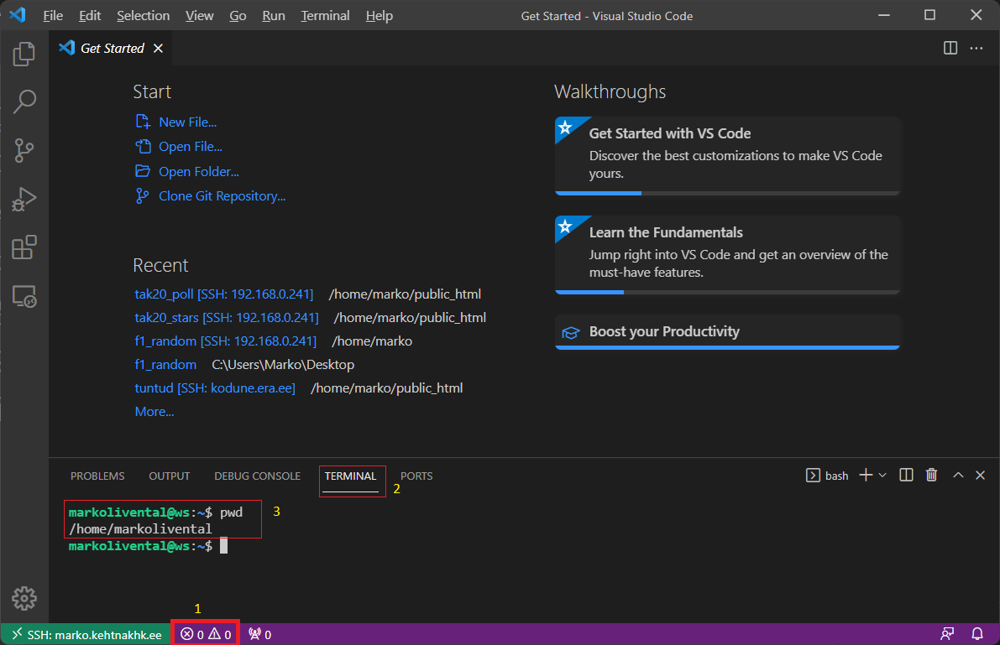

# Paigaldamine

1. Käivita Visual Studio Code ning tekita SSH ühendus kooli serveriga. Tulemus peaks olema selline nagu alloleval pildil. 
   - Kui avaneb mingi projekt, siis käivita Visual Studio Code teist korda uuesti või sulge olemasolev projekt
   - Klikka number 1 juures
   - Klikka number kaks juures (Terminal)
   - Kirjuta käsklus number 3
     ```
     pwd
     ```
     - **/home/markolivental** markolivental asemel on teie kasutajanimi, siis olete õiges kohas!
     - Kui näitab mingi muud kausta, näiteks /home/markolivental/tak20_crud siis kirjuta käsklus
     ```
     cd
     ```
     ning peale seda jälle **pwd** siis nüüd peaks olema õiges kohas **/home/markolivental**
   - 
2. Lae alla fail käsureal 
   ```
   wget https://github.com/OkramL/tak20_stars/archive/refs/heads/master.zip
   ```
3. Liigu kausta public_html
   ```
   cd public_html
   ```
4. Paki zip fail lahti public_html kausta
   ```
   unzip ../master.zip
   ```
5. Nimeta kaust tak20_stars-master ümber tak20_stars
   ```
   mv tak20_stars-master tak20_stars
   ```

# Seadistamine
Nüüd on asjad nii kaugel, et võid Visual Studio Code's avada kausta (Open Folder) **/home/markolivental/tak20_stars**, kus **markolivental** asemel on teie kasutajanimi

- Faili **config/config-sample.php** tuleb ümber nimetada **config/config.php**
- Failis **config/config.php** tuleb andmebaasi ühenduse osas teha sulle vajalikud parandused
- Faili **tak20_stars.sql** sisu tuleb importida andmebaasi mille defineerisid eelmises punktis
- Failis **config/common.php** rida **$ProjectFolder = "/~marko/tak20_stars/";** peab olema **$ProjectFolder = "/tak20_stars/";** kui on tegemist kooli serveriga
- Failis **.htaccess** rida **RewriteBase /~marko/tak20_stars/** peab olema **RewriteBase /tak20_stars/** kui on tegemist kooli serveriga
- Kui projekti kausta nimi pole enam **tak20_stars** siis pead lisaks eelnevale kahele punktile lisa paranduse tegema. **tak20_stars** asendama õige kausta nimega. Aga seda tead ju sa ise!

Kui nüüd kõik läks õigesti, siis peaksid pääsema lehele ligi https://eesnimi.kehtnakhk.ee/tak20_stars/, kus eesnimi on SINU eesnimi!
